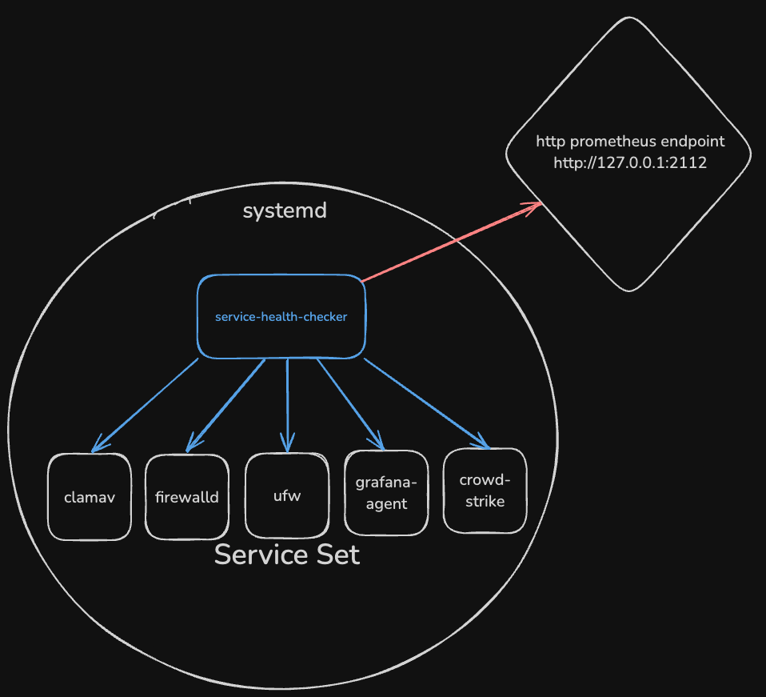

# Overview

This is a really simple Golang app to wrapper `systemctl` for your services and serve simple metrics for health on them.

This application runs as a systemd service and gets the health of services either running or not via a systemctl call

## Specifics

 The app calls to `systemctl is-active <service_name>` and then serves up the validated and interpreted response to a prometheus http endpoint `http://localhost:2112/metrics`. The prom-http endpoint contains timeseries based on the services declared in the `config.json`. The timeseries looks something like this:

```text
service_health_status{service_name="<service_name>"} (1|0)
```

The default working directory is `/opt/service-checker` but this can be changed in the service file for systemd.

There isn't much customization right now but coming soon:tm:

Here is the basic architecture:



## Use

Download the service-checker.exe and place into `/opt/service-checker` directory, then copy the `service-health-check.service` file into `/etc/systemd/system/`. Then create a `config.json` at the `/opt/service-checker` directory and add/remove the desired services.

The `config.json` should look like this:

```json
{
    "services": ["salt-minion", "clamav-daemon", "grafana-agent"],
    "interval": 10,
    "server": {
      "url": "127.0.0.1",
      "port": 2112
  }
}
```

Interval is the delay in which application uses to check the service health. This defaults to 10 seconds but can be shortened or extended.
Next run the following

```shell
sudo systemctl daemon-reload
sudo systemctl enable service-health-check
sudo systemctl start service-health-check
```

You can then validate with `curl -k http:localhost:2112/metrics` you're seeing timeseries that can be ingested / scraped.
